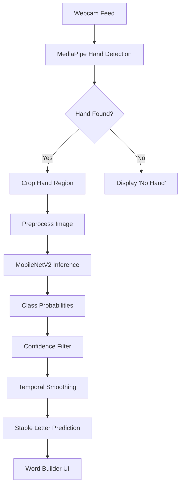

# SignBridge: Real-Time Sign Language Alphabet Recognition System

<div align="center">
  
  
  
  
  
</div>

## 📖 Project Overview
SignBridge is a professional-grade assistive technology prototype designed to recognize American Sign Language (ASL) alphabet gestures in real-time via a webcam feed and translate them into readable text. The system empowers deaf and hard-of-hearing individuals, as well as those learning ASL, to communicate effortlessly with non-signers.

The application features continuous word-building, temporal prediction smoothing, and a professional user interface.

## 🎯 Objectives
- Accurately detect hand landmarks in real-time using **MediaPipe**.
- Classify static sign language alphabet gestures (A-Z, space, delete, nothing) using a **Deep Learning CNN (MobileNetV2)**.
- Filter out prediction flicker using **temporal smoothing** and majority voting.
- Provide a robust, accessible **UI** allowing users to string together letters into complete words.

## 🧠 System Architecture


## 📊 Dataset Information
This project utilizes the [Kaggle ASL Alphabet Dataset](https://www.kaggle.com/datasets/grassknoted/asl-alphabet) consisting of 87,000 images across 29 classes:
- **A-Z** (26 letters)
- **Space**
- **Delete**
- **Nothing** (background)

*Limitation Note:* The letters **J** and **Z** in real ASL involve dynamic motion. This dataset represents them as static snapshots, which is a known constraint of image-only classification.

## ⚙️ Technology Stack
- **Deep Learning:** TensorFlow, Keras (MobileNetV2)
- **Computer Vision:** OpenCV, MediaPipe Hands
- **UI Framework:** Streamlit
- **Data Manipulation:** NumPy, Pandas, Scikit-learn
- **Visualization:** Matplotlib, Seaborn

## 🚀 Installation & Setup

1. **Clone the repository**
   ```bash
   git clone https://github.com/Aditya-mahapatra-17/sign-language.git
   cd sign-language
   ```

2. **Set up a Virtual Environment**
   ```bash
   python -m venv venv
   source venv/bin/activate  # On Windows use: venv\Scripts\activate
   ```

3. **Install Dependencies**
   ```bash
   pip install -r requirements.txt
   ```

4. **Prepare Dataset**
   Download the Kaggle ASL Alphabet Dataset and extract it so that the training images reside in `data/raw/asl_alphabet_train/asl_alphabet_train/`.

## 🏋️ Training the Model
To train the model on your local machine (GPU recommended):
```bash
python train.py
```
This script handles data splitting (70/15/15), augmentation, transfer learning compilation, early stopping, and saving the best model weights to `models/sign_language_model.keras`.

## 📈 Evaluation
To generate a classification report and a confusion matrix on the testing set:
```bash
python evaluate.py
```
Check `outputs/plots/` for the generated metrics.

## 🖥️ Running the Application
Launch the real-time Streamlit application:
```bash
streamlit run app.py
```
Ensure your webcam is functioning. Click "Start Camera" in the UI to begin recognition.

## 🔒 Privacy Considerations
- **Local Processing:** All webcam feed processing is done locally on your machine.
- **No Data Collection:** Video frames are neither saved permanently nor transmitted to external servers.

## 🔮 Future Enhancements
1. **Dynamic Gesture Recognition:** Implement LSTM or Transformer architectures to handle motion-based signs (J, Z) and full word translations.
2. **Two-Handed Signing:** Expand detection logic for sign languages that utilize both hands (e.g., BSL).
3. **Text-to-Speech (TTS):** Integrate audio output for generated words.
4. **Edge Deployment:** Convert model to TensorFlow Lite for deployment on mobile devices.

## ⚖️ Ethical Considerations
This system is an *assistive prototype*, not a certified replacement for human interpreters. Accuracy relies heavily on lighting, skin tone contrast, background noise, and dataset bias. Do not use this tool as the sole method of communication in critical medical or legal scenarios.

## 📄 License
This project is licensed under the MIT License.
